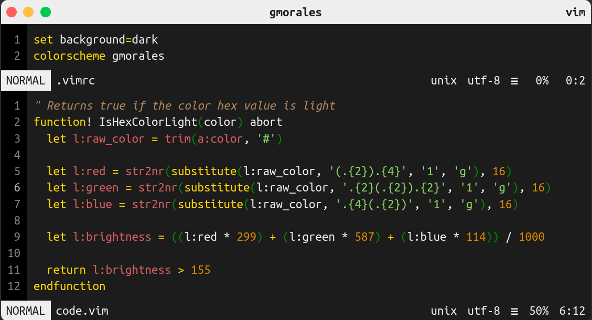
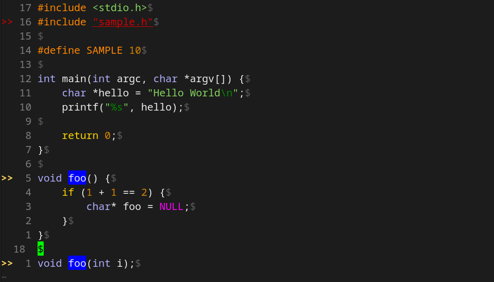

# gmorales-colorscheme

## Description

A simple dark theme for vim.

It is designed for use in dark and bright environments, and for clear readability without straining your eyes.

The color codes are in https://www.ditig.com/256-colors-cheat-sheet

You can see the theme in: https://vimcolorschemes.com/gmorales08/gmorales-colorscheme

## How to install

1. Copy the `colors` directory, that contains the theme, into your `~/.vim` directory, or if you have already a `~/.vim/colors/`directory, copy the file `gmorales.vim` into your `~/.vim/colors/`
2. Open your `~/.vimrc` file and add the line `colorscheme gmorales` to activate the theme.
3. Reload your `~/.vimrc` and check that the colors change.

## Images
Sample of vim code:

Sample of c code:
